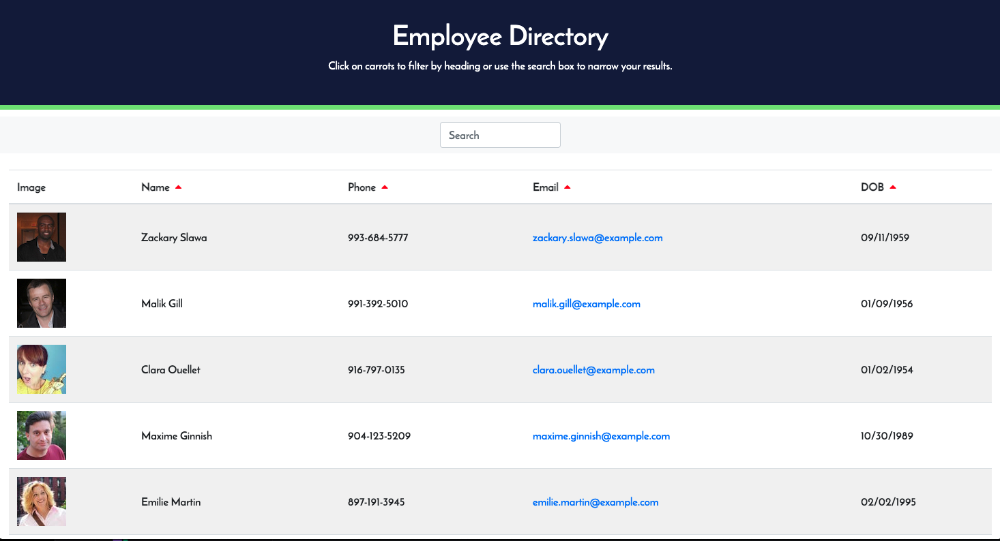

# React Employee Directory

  ## Badge

  

  ## Description

  A dynamic staff directory utilizing React JS.

  View the deployed application [here](https://jnel-221.github.io/React-Team-Directory/)!
  
  ## Table of Contents
  
  - [Installation](#Installation)
  - [Usage](#Usage)
  - [License](#License)
  
  ## Installation

  ```bash
  Clone the repo and save it to your desired location.  In the terminal run NPM i to install dependencies.  Run npm start to start the server and see the app in the browser.
  ```

  [Back to Table of Contents](#table-of-contents)
  
  ## Usage

  Use the search field to search directory by employee name.  Click on the carets to search for employees by name, phone number, email, or DOB.

 
  

  
  

  [Back to Table of Contents](#table-of-contents)
  
  
  ## Questions
  
  Questions? You can reach me by email at jennifer.nelson242@gmail.com. Feel free to check out additional projects at [my GitHub profile](https://github.com/jnel-221).

  [Back to Table of Contents](#table-of-contents)
  
  ## License

  This project is licensed under the [MIT](license) license.
  
  [Back to Table of Contents](#table-of-contents)